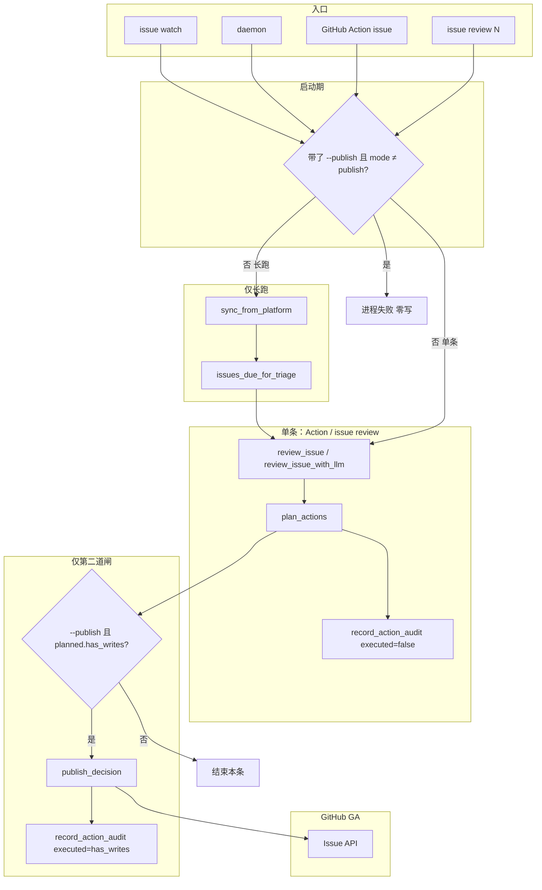
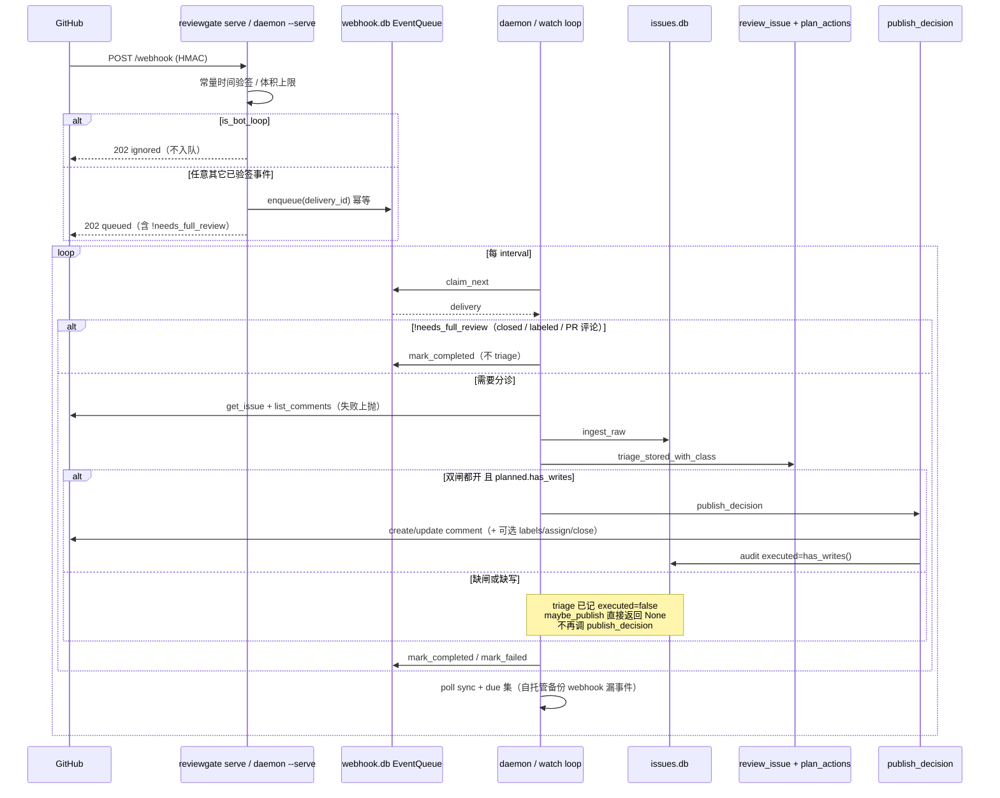

# ReviewGate Issue 分诊：生产可用方案

| 字段 | 值 |
| --- | --- |
| 作者 | TBD |
| 日期 | 2026-08-17 |
| 状态 | Draft（评审修订 2） |
| 仓库 | `/Users/mengmian/Develop/app/ReviewGate`（workspace `0.12.0`） |
| 范围 | 把 `reviewgate issue …` 做成与代码闸口对等的**对等产品**，GitHub GA；不是 crate 拆分、不是品牌改名、不是重写 |

---

## Overview

Issue 分诊管线已经能对单条 Issue 做「规范化 → 安全评分 → 分类 → 完整度 → 查重 → 裁决 → 按类型措辞」，写回走唯一出口 `plan_actions` + `publish_decision`。双闸（`[issue_review] mode = "publish"` **且** CLI `--publish`）在 `issue review` 上是真的：`mode=suggest` 加 `--publish` 会在 `issue_review_cmd` 直接 `bail`，不会打印假的 `published`。

产品缺口是闭环断在长跑入口：`issue watch` / `daemon` **从不调用** `publish_decision`。维护者无法在 CI / webhook / 轮询里得到自动的第一遍回复，只能手敲 `issue review --publish`。本文给出最小改动方案：把同一套双闸接到 `watch` / `daemon` / GitHub Action，补齐幂等、webhook 安全、文档类召回与诚实文档，使中等规模 GitHub 仓库（数百条存量、每周数十条新单）可以生产使用。

---

## Background & Motivation

### 产品定位（已拍板）

- Issue 分诊是**对等产品**，不是代码闸口的附属功能。
- 市场空白：自托管、多 forge（GitHub / GitLab / Gitee / AtomGit）、规则优先 + 保守写回、按类型回复、没把握转人工。
- 用户已同意：长跑发布走**现有双闸**，并加显式 CLI `--publish`（以及 Action input），与 `issue review` 同一语义。

### 当前实现（已对照代码，不编造）

| 能力 | 现状 | 关键路径 |
| --- | --- | --- |
| 主管线 | `normalize → safety → classify → completeness → duplicate → judge → comment` | `crates/core/src/issue/pipeline.rs` `triage_stored_with_class` |
| 写回规划 | `plan_actions`；`mode≠publish` 时立即返回「什么都不写」 | `crates/core/src/issue/action.rs` |
| 写回执行 | 仅 `publish_decision`：评论 create/update、标签、指派、关闭 | `pipeline.rs` `publish_decision` |
| 双闸（单条） | `mode=suggest` + `--publish` → CLI 拒绝；`publish=false` 时 `plan_actions` 全挡 | `crates/cli/src/main.rs` `issue_review_cmd`；`crates/cli/tests/cli.rs` `issue_publish_in_suggest_mode_is_refused` |
| 审计 | `triage_stored` 记 `executed=false`；`publish_decision` 仅在 `planned.has_writes()` 时记 `executed=true` | `store.rs` `record_action_audit` |
| 已接线配置 | `enabled`、`sync.overlap`、`sync.max_history_issues`、`actions.update_existing_comment`、`needs_llm_fallback` 的 `LLM_FALLBACK_MARGIN` | `issue_review_cfg_from_file`；`classify.rs` |
| 长跑 | `watch` / `daemon` 只 `sync` + `review_issue[_with_llm]` + stderr 打印 | `issue_watch` / `issue_daemon` |
| Webhook | GitHub HMAC + GitLab token；无 Gitee/AtomGit 解析；GitLab `is_bot_loop` 恒 `false`；单次读 64KB；HMAC 用 `!=` 非常量时间 | `webhook.rs` / `serve.rs` |
| GitHub Action | 只跑 `reviewgate review`，仅 `pull_request` | `integrations/github-action/action.yml` |
| Skill | 只教 `reviewgate review` | `integrations/claude-skill/SKILL.md` |
| 分类短板 | 真实标签上 documentation 召回 ~20–25%；规则「自信地错」，LLM 兜底触发不了 | `docs/LIMITATIONS.md` §11；`scripts/eval-issue-groundtruth.py` |
| 查重 | FTS + 错误签名 + **128 维 FNV 哈希嵌入**（`reviewgate-local-hash`） | `embedding.rs` |
| 验证 | `--verify` 在 cli/cli 1020 条上约 +9 个百分点判别力 | LIMITATIONS §11 |
| 两个 Forge | `forge::Forge`（PR 评论，无 Gitee）vs `issue::IssueForge`（有 Gitee） | 本次不合并 |
| 远程 slug | `parse_github_slug` 只认 github.com | `main.rs` |
| 评论翻页 | 各适配器 `per_page=100` 且只拉第一页 | `platform.rs` |
| 关重复 / 关 invalid | CLI 映射里 `close_invalid` / `close_duplicate` **写死 false** | `issue_review_cfg_from_file` |

文档与代码一致地写着：「只有 `issue review --publish` 会往平台上写」。这在观察期是安全的，但使长跑无法成为产品。

### 痛点

1. **闭环断裂**：观察可以自动化，回复必须人手。对「每周几十条新 Issue」的维护者，这等于产品没交付。
2. **打开 publish 有隐藏坑**：`untriaged_issues` 只看 `last_reviewed_at IS NULL`；`upsert_issue` 用 `COALESCE` **不**因哈希变化清空该字段。编辑过的 Issue 在纯轮询下不会复审。更糟的是 sync 哈希含 bot、review 哈希不含——due 集若直接比这两列，`--publish` 会自我复审循环。
3. **`find_bot_comment` 只看升序第一页**：热闹 Issue 上最新评论在最后一页，会再发一条。降序短扫必须与列表同级页顶，且不能用裸 `Option` 把「截断没看见」当成「确定没有」。
4. **文档类「自信地错」**：近平局 LLM 兜底救不了 documentation。
5. **对外表述不完全诚实**：中文 README「语义向量」；平台矩阵没有 GA / preview 区分；Skill / Action 不提 Issue。

---

## Goals & Non-Goals

### Goals

1. 定义并验收 **production-ready**（下一节清单）。
2. 闭合回路：`watch` / `daemon` / webhook worker / GitHub Action → 同一套 `plan_actions` + `publish_decision`，双闸缺一不可。
3. 写安全：默认 observe-only；`close_spam` / `add_labels` 仍单独关；不默认回填历史。
4. 失败可恢复：同步封顶不推进游标、拉评论失败上抛、webhook 重试、闸门单子 `stats --gated` 可见；**没有写出时不得 `executed=true`**。
5. 诚实平台矩阵：GitHub GA；GitLab / Gitee / AtomGit preview。
6. 提高 documentation 在**有 LLM** 时的召回，且 **security 精确度不得回退**；无 LLM 只允许显式线索改类型。
7. 最小可观测性：沿用 `issue stats`、`record_action_audit`、stderr；每轮打印 published 计数。

### Non-Goals

- crate 拆分、品牌改名、外部 embedding 服务。
- 自动关闭重复 Issue（`close_duplicate` 保持 false）。
- 优先级打分、新的 verdict 类型。
- 默认打开任何写操作。
- 合并 `Forge` 与 `IssueForge`。
- 把审查闸口的误 BLOCK / 请求级超时纳入本 GA 关键路径（并行轨道，见文末）。
- 新 metrics 栈、Prometheus、远程 APM。

---

## Production-ready definition（验收条）

**定义**：一个中等规模 GitHub 仓库的维护者可以：

1. 在 CI / webhook 或长跑进程里打开 Issue 分诊。
2. 得到按类型的第一遍（分类、查重、可选 verify、评论），而不必对每条手跑 `issue review --publish`。
3. 信任写安全：默认只观察；必须 `mode=publish` **且** `--publish`（或 Action `publish: true`）才写；关广告与打标签仍单独开。
4. 从失败恢复：不完整同步、拉评论失败、webhook 重试、被闸门拦住的单子可见，不会静默丢弃，也不会在没写出时标成已执行。
5. 知道诚实的平台矩阵：GitHub GA；其余 preview。

**不要求**：crate 拆分、改名、外部向量、自动关重复、优先级、默认写。

### 可测量验收测试

下列命令在 fixture 或隔离仓库上跑。期望写进对应 PR 的测试，而不是靠手工「感觉对」。

| # | 场景 | 命令 / 步骤 | 期望 |
| --- | --- | --- | --- |
| A1 | 默认只观察 | `reviewgate issue watch --fixture --max-iterations 1`（`mode` 缺省 / `suggest`） | 退出 0；fixture 平台评论数不增；stderr **无** `published=created` / `published=updated`（允许汇总 `published=0` 或省略 per-issue 行）；`stats` 的 `executed on platform` 为 0 |
| A2 | 只开配置闸 | `mode=publish`，**不加** `--publish`，跑 `watch --fixture --max-iterations 1` | 与 A1 相同：规划可算、审计 `executed=false`，平台零写 |
| A3 | 只开 CLI 闸 | `mode=suggest` + `watch --publish --fixture` | **非 0 退出**；stderr 含 `mode` 与 `publish`；无 `published:` / `published=created`；与 `issue_publish_in_suggest_mode_is_refused` 同文案族 |
| A4 | 双闸都开才写 | `mode=publish` + `watch --publish --fixture --max-iterations 1`，**同一进程、fixture 平台在 loop 外** | 对未审 fixture 单子 `create_comment`；stderr 有 `published=created`；**不要**在本条断言「再跑一轮 update」 |
| A5 | daemon 同契约 | 同上，换 `daemon --publish` / 不带 `--publish` | 与 A2–A4 一致；`daemon --serve` 仍缺 secret 即失败（已有 `cli_daemon_serve_refuses_the_publicly_known_default_secret`） |
| A6 | 已审未改跳过 | 接 A4 **同一进程** `max-iterations 2`，第二轮不改正文/用户评论 | `skipped_unchanged≥1`；`create_comment` 次数仍为第一轮的值；**不**调用第二次 `publish_decision` |
| A7 | 正文变更复审 | 接 A4 **同一进程**：改 fixture 标题后再跑一轮（平台不得 `new()`） | 进入 due 集；`update_comment` 同一条，评论总数不增 |
| A8 | 观察后再开 publish **不回填** | 先 A1 审完（同进程或同 `--data-dir`），再加 `--publish` 且内容未变 | **不得**给观察期已审、内容未变的单子补发评论 |
| A9 | 闸门可见 | 低置信 + 空 `on_needs_triage` | `issue stats --gated` 列出；`handed_off` / `NOT handed off` 与现在一致 |
| A10 | 拉评论失败不假成功 | 适配器 `list_comments` 出错 | `review_issue` 返回 Err；watch/daemon **fixture 与 live 同一 `match`** 打 `review failed`，不 `?` 掉整轮；不 `save_review` 成「无评论」；不 publish |
| A11 | 同步封顶不丢 | `max_issues_per_run` 小于存量 | stderr 含 `(capped)`；游标不前进（已有 `sync_from_platform` 行为） |
| A12 | webhook 验签 | 错签名 POST `/webhook` | 401；不错签入队 |
| A13 | webhook 幂等 | 同一 `X-GitHub-Delivery` 两次 | 第二次 202 `duplicate`；队列仍一条 |
| A14 | Action 默认不写 | 新 issue Action，`publish` 缺省 | 只跑 `issue review`，不加 `--publish` |
| A15 | 文档回归（两套门禁，见 §6） | 语料单测；清空 reviews 或新 `--data-dir` + `--force-retriage` 后再跑 eval | 无 LLM：显式线索语料钉死，**不**用 groundtruth docs 召回当硬门。有 LLM：documentation 召回相对改前 ≥ +10pp。两套都要 **security 精确度不降** |
| A16 | 诚实文档 | README / ISSUE_TRIAGE / LIMITATIONS / Skill | 不再写「watch 永不写」；不再把哈希嵌入叫「语义向量」；平台矩阵分 GA/preview |

---

## Target architecture

原则：**一条写路径**。长跑、webhook worker、Action 都只是「要不要调用已经存在的 `publish_decision`」。

`--publish` / `mode` **只包住写回**。长跑（watch/daemon）走 `Sync → Due → Rev → Plan`。**Action 与 `issue review <N>` 不走 Sync/Due**——按图抄成 `watch --max-iterations 1` 就是已否决的空盘回填（Alternative F）。`mode=suggest` 且带了 `--publish` 仍在**启动期** `bail`。



### 长跑 + webhook 时序



GitHub CI **只**用事件驱动：Action 对 `github.event.issue.number` 调一次 `issue review`，可选 `--publish`。幂等靠平台上的 `find_bot_comment`，不依赖 runner 磁盘上的 `issues.db`。

**禁止**把 `schedule` + `watch --publish` 写成与 daemon poll「同构」。Actions runner 默认每次空盘，due 集 = 本轮 sync 到的全部存量，`--publish` 就是回填炸弹（D5 / A8 失效）。补漏只推荐自托管 `daemon` 的持久 `data_dir`。若有人坚持用 Actions cron：必须 `actions/cache` 恢复 `.reviewgate/issue/issues.db`，**cache miss 则禁止传 `--publish`**——这不是默认示例，不进 example workflow。

---

## Proposed Design

### 1. 把双闸接到长跑（产品主洞）

**现状**：`issue_watch` / `issue_daemon` 在 `review_issue*` 之后只 `eprintln` 裁决，没有 `publish_decision`。

**改动**（最小）：

1. `IssueWatchArgs` / `DaemonArgs` 增加 `--publish`，默认 `false`，帮助文本与 `IssueReviewCliArgs.publish` 对齐。
2. 抽出 CLI 私有辅助（**不要**在 core 再开第二条写路径）：

```rust
// crates/cli/src/main.rs（建议名，实现时以测试为准）
fn refuse_publish_unless_mode_allows(cfg: &IssueReviewConfig) -> anyhow::Result<()> {
    if !cfg.actions.publish {
        anyhow::bail!(
            "--publish requires [issue_review] mode = \"publish\" (current mode is suggest; nothing was posted)"
        );
    }
    Ok(())
}

async fn maybe_publish(
    store: &IssueStore,
    platform: &dyn IssuePlatform,
    out: &ReviewOutput,
    want_publish: bool,
) -> anyhow::Result<Option<PublishResult>> {
    if !want_publish || !out.planned.has_writes() {
        return Ok(None);
    }
    Ok(Some(publish_decision(store, platform, out).await?))
}
```

长跑里 `!has_writes` 直接返回，避免 `publish_decision` 再 `save_review` + 再插一条 `executed=false` 把 `stats.total` 翻倍。`skipped_truncated` 仍是 `Ok(Some(result))`：stderr 记 `publish_failed`（原因 truncated），**不要** `?` 进 drain。单条 `issue review --publish` **保持现网**：不看 `has_writes`，方便 fixture 测第二次 update。两条路径的差异写进 §7。

3. `issue_review_cmd` 改为调用同一 `refuse_publish_unless_mode_allows`，避免三处文案漂移。
4. `watch` / `daemon` 在进入循环前：若 `args.publish` 则 `refuse_…`。循环内每条 `Ok(out)` 后 `maybe_publish`。失败打 stderr、**不**把整轮打成成功静默。
5. `daemon` 的 queue handler 与 poll 分支走同一 `maybe_publish`。**`daemon --serve --publish` 不得早于 PR 4 合入**（见 PR Plan）。
6. `daemon` 补 `--llm`（与 `watch` 对齐）。无 `--llm` 时继续 `review_issue`（不定模型）；有则 `review_issue_with_llm`。发布默认仍是确定性话术。
7. `watch` / `daemon` **仅这两处**增加 `--force-retriage`（默认 false）。挑选集**不是** due：`list_issue_numbers()`（已有，`store.rs` 307）按 `issue_number` 升序取前 `--max-issues-per-run` 条，对每条再跑 `review_issue*`。评测改规则用，不进生产默认。`issue review <N>` **不加**该旗标——点名本来就审，加上只会和 API 节漂移。
8. fixture 与 live 的单条错误处理收成同一条 `match`：一条失败打 `review failed`，不 `?` 掉整轮。`FixturePlatform` 必须提到 `loop` **外**，否则跨 iteration 测 update / skip 没有可观测对象（现网 `issue review --fixture --publish` 能测二次 update，是因为同一次进程对同一平台调两次）。

`issue review` 另加 `--no-llm`（D17）：即使 `Config` 里有 provider，也不建客户端、不分类兜底、不润色说明。用于 Action 默认关模型和本地复现确定性输出。

**单闸行为（必须写进帮助与文档）**：

| `mode` | `--publish` | 行为 |
| --- | --- | --- |
| `suggest`（默认） | 否 | 只分析、落库、打印。`plan_actions` 因 `policy.publish=false` 全挡，`reasons_blocked` 含 `suggest_mode:writes_disabled` |
| `suggest` | 是 | **立刻失败**，整进程不进入循环。文案与现网 `issue review` 相同 |
| `publish` | 否 | 仍只观察。`plan_actions` **会**规划写（与今天 `issue review` 不加 `--publish` 一样），审计 `executed=false`，渲染/日志可预览。**零平台写** |
| `publish` | 是 | 对 due 集调用 `publish_decision`。具体写什么仍看 `[issue_review.actions]` |

不把 `cfg.actions.publish` 改成 `args.publish`。配置闸表示「仓库允许写」，CLI 闸表示「这一进程允许写」。改掉会破坏 `mode=publish` 下 dry-run 预览（`plan_actions` 会变成全挡，维护者看不到将要发的评论）。

**不回填**：打开 `--publish` 后只处理 due 集里的「从未审过」或「内容/用户评论哈希变了」的单子。观察期已审且未改的单子保持沉默。要补发用 `issue review <N> --publish`。**不**加默认 `--backfill-unpublished`（可作为以后显式旗标，不进 GA）。

同一仓库 **只选一个写入口**：`watch --publish` **或** `daemon --serve --publish` **或** Action `publish: true`。三个都调 `publish_decision`，分页修好后会落到同一 marker，但仍双倍 API、互相抢更新、自己的评论再入队。Stage 1 文档写死互斥。

### 2. Due 集：跳过未改、复审已改

**现状**：

- `IssueStore::untriaged_issues`：`last_reviewed_at IS NULL`。
- `upsert_issue`：`last_reviewed_at=COALESCE(excluded.last_reviewed_at, issues.last_reviewed_at)`。`ingest_raw` 传入 `None`，所以正文变了也不清 `last_reviewed_at`。
- 同步侧：`source_updated_at == raw.updated_at` 则跳过拉评论（配额正确）。
- webhook `edited` 直接 `review_issue(number)`，不经过 untriaged。
- **哈希集合不一致（今天无循环，D6 落地后会有）**：`sync_from_platform` 把 `list_comments` 的**全部**评论交给 `ingest_raw`；`review_issue_with_llm` 先滤 bot / marker 再 ingest，`save_review` 写的是**用户评论**哈希。`publish_decision` 发评后 GitHub 推进 `updated_at` → 下轮 sync 再拉全量（含刚发的 bot）→ `issues.comments_hash` 变了 → 再次 due → 再 update → 再变。

纯 `watch` 部署会漏掉编辑。加上 publish 后，若不修哈希集合，**`--publish` 自己会制造 due**。

**不变量（PR 2 的硬门槛）**：凡写入 `issues.comments_hash` 或 `issue_reviews.comments_hash` 的评论集合必须相同：去掉 `is_bot_comment` / `BOT_COMMENT_MARKER` / `user_type=Bot`。抽出 `filter_user_comments`，`sync_from_platform` 与 `review_issue_with_llm` **共用**。Due 比较的两侧因此同构。

**改动**：新增 `IssueStore::issues_due_for_triage(limit) -> Vec<u64>`，watch / daemon poll **替换** `untriaged_issues`（保留旧函数给测试/调试）。

Due 当且仅当（在上述过滤之后）：

1. 没有任何 `issue_reviews` 行，或 `last_reviewed_at IS NULL`；**或**
2. 最新一条 review 的 `content_hash` ≠ 当前 issue；**或**
3. 最新一条 review 的 `comments_hash` ≠ 当前 issue。

**不**把 `published_comment_id IS NULL` 放进 due。那会在第一次开 `--publish` 时对整个观察期存量发评论。

`review_issue` 本身仍总是拉平台并 triage（单条 CLI / webhook 点名就要审）。长跑挑选器才 skip。`--force-retriage` **换挑选器**：`list_issue_numbers` + budget，不再调用 `issues_due_for_triage`。若仍走 due，哈希未变的单子不在集里，旗标是空转。

Webhook worker **不再**为「省 API」做 hash 短路：同一 `X-GitHub-Delivery` 已由 `INSERT OR IGNORE` 去重（A13），重试不会二次 drain。要算 hash 仍得 `get_issue` + `list_comments`，省的只是本地 classify。不同 `delivery_id` 的 `edited` 应再审（标题/正文可能变了）。标签-only 的 `edited` 多审一次可接受。

改规则后重测：`watch --no-sync --force-retriage`，或换新 `--data-dir` 再跑 `eval-issue-triage.sh`。不要靠人手删 `issue_reviews`。

### 3. 评论翻页与 PR 排除（写幂等）

各 `list_comments` 目前第一页 100 条。GitHub 默认 `sort=created` **升序**，最新评论（含 bot）在**最后一页**。只拉第一页时，热闹 Issue 上 `find_bot_comment` 找不到 marker，会再发一条。

**不要**「升序硬顶 10 页」当唯一策略：那只保留最旧 1000 条，bot 在第 1001 条时仍双评，due 也看不到最新用户评论。

**拍板（D19）**：

`created` **不因 PATCH 更新而变**。冷单第一次 `create` 后用户再盖几百条，bot 会掉出「最新 300 条」。3 页硬顶 + 裸 `Option` 会把「没看见」和「确定没有」混为一谈，热闹单永远 `publish_failed`。

| 用途 | 排序 | 硬顶 | 超顶 |
| --- | --- | --- | --- |
| `list_comments`（哈希 / 分析） | 升序翻页 | 10 页 = 1000 | stderr 打 `comments_truncated`；哈希只覆盖已拉到的用户评论 |
| `find_bot_comment` | `sort=created&direction=desc`，**独立**扫 | **同样 10 页 = 1000 条最新**（不要 3 页） | 见下方决策表 |

把 `IssuePlatform::find_bot_comment` 的返回值从 `Option<String>` 改成：

```rust
pub enum BotCommentLookup {
    Found(String),
    Absent { truncated: bool },
}
```

禁止继续用裸 `Option`。`publish_decision` 决策：

| 本地 `latest_published_comment_id` | API | 动作 |
| --- | --- | --- |
| 有 id | 任意 | **优先 `update_comment(id)`**（GitHub 按 comment id，不依赖翻页）。404（人删了）再走下一行 |
| 无 | `Found(id)` | `update_comment(id)` |
| 无 | `Absent { truncated: false }` | `create_comment`（确定扫完，新单） |
| 无 | `Absent { truncated: true }` | **禁止 create**（fail-closed）。**返回 `Ok(PublishResult { skipped_truncated: true, .. })`，不是 Err** |

`IssueStore` 增加 `latest_published_comment_id(issue_number) -> Option<String>`：最新一条 `issue_reviews.published_comment_id`（`ORDER BY analyzed_at DESC`，跳过 NULL）。现网 `latest_review()` 只反序列化 `decision_json`，用不上已有列。Action 无持久库 → 只能走 API 行；冷单第一次仍是 `Absent { truncated: false }` 可 create。

`skipped_truncated` 时：审计 `executed=false`；stderr `publish_failed`（原因 `truncated`）；**handler Ok**，`drain` `mark_completed`。只有网络 / 5xx 才 `Err` 让 drain 重试。截断不是瞬时故障，用 Err 会把热闹单每条 `issue_comment` 打进 dead letter——D16 刚堵过的洞。

Gitee 写死 `page=1` 一并改掉。GitLab notes：列表升序翻页；找 bot 降序，同样 10 页顶 + `BotCommentLookup`。

`review_issue` 遇 `raw.pull_request.is_some()`：**Ok-skip**——不 ingest、不 publish、不返回 Err（D16）。`drain_queue_once` 对 Err 会重试 5 次再 `dead_letter`；PR 上的 `issue_comment` 今天 `needs_full_review` 为真，用 Err 会把每个 PR 评论打进死信。

Webhook：`parse_github_event` 若 `/issue/pull_request` 存在，置 `needs_full_review=false`（入队仍可 202，drain 跳过 triage）。Action 的 `if: !pull_request` 盖不住 daemon webhook，core 必须自己跳。

### 4. Webhook：验签、体积、bot loop、drain 过滤

文件：`crates/core/src/issue/webhook.rs`、`serve.rs`、`queue.rs`。

| 洞 | 现状 | GA 做法 |
| --- | --- | --- |
| HMAC 非常量时间 | `expected.as_slice() != got.as_slice()` | `HmacSha256` 算完后 `Mac::verify_slice(&got)`（hmac 0.12，常量时间） |
| GitLab token `==` | `h == secret` | 先比长度，再 `subtle::ConstantTimeEq`（hmac/digest 已间接依赖；若要直接用 `subtle` 则锁定版本） |
| 64KB 单次 read | `vec![0u8; 64*1024]` + `read` 一次 | 按 `Content-Length` 读满；缺省/超限 **413**；上限 **1 MiB**；截断体不得验签通过。GitHub 上限是 25MB，偶发超长 `issues.opened` 会 413——**不要**写成「所有 GitHub 事件都能进队」。413 打 stderr（`repo` / `delivery_id` / `content-length`）；运维手册写「超限靠自托管 watch/daemon poll 补」 |
| GitLab `is_bot_loop` | 恒 `false` | **只修 Issue Hook**（`object_kind=issue`）：作者 username ∈ `bot_logins` 或正文含 marker 则忽略。GitLab **Note Hook**（`object_kind=note`）今天不解析、`needs_full_review` 为假——PR 4 **不**声称评论环闭合 |
| `needs_full_review` 未用 | 只出现在 202 JSON | **先入队再过滤**（与现网 enqueue 一致）。`is_bot_loop` 不入队、202 ignored。其余验签通过的一律 enqueue + 202 queued。drain 按 `event_type`+`action`+`issue.pull_request` 重算；`closed`/`labeled`/PR 评论 `mark_completed`、不 triage |
| Gitee / AtomGit 解析 | 无 | **preview 保持缺口**。未识别的头不要当 GitHub 验签；可 400 + 日志 |
| 默认 bot login | `reviewgate[bot]`、`reviewgate-bot` | 加上 `github-actions[bot]`（Action 用 `GITHUB_TOKEN` 发评）。正文 marker 仍是主循环刹车 |
| serve vs daemon 队列路径 | serve 默认 `.reviewgate/issue/webhook.db`；daemon 用 `data_dir/webhook.db` | 文档写死：standalone `serve --queue` 必须与 daemon `--data-dir` 对齐 |

失败策略保持：缺 `REVIEWGATE_WEBHOOK_SECRET` 进程退出；claim 失败 `attempts<5` 则 `retry_pending`，否则 `dead_letter`。daemon 每轮打印 `queue pending/retry/dead`。

### 5. GitHub Action（GitHub GA 的 CI 形态）

**不改**现有 `integrations/github-action/action.yml`（PR 闸口）。新建：

- `integrations/github-action/issue/action.yml`
- `integrations/github-action/example-issue-workflow.yml`

```yaml
# example-issue-workflow.yml（草案）
name: ReviewGate Issue
on:
  issues:
    types: [opened, edited, reopened]
  issue_comment:
    types: [created, edited]

permissions:
  contents: read
  issues: write

jobs:
  triage:
    if: ${{ !github.event.issue.pull_request }}
    runs-on: ubuntu-latest
    steps:
      - uses: actions/checkout@v4   # 实现时核官方当前 tag；现网 PR example 用 v5，以当时 marketplace 为准
      - uses: dengmengmian/ReviewGate/integrations/github-action/issue@v0
        env:
          GITHUB_TOKEN: ${{ secrets.GITHUB_TOKEN }}
          # 不要无条件注入 REVIEWGATE_API_KEY（见 D17）
        with:
          publish: "false"   # 观察期；双闸第二道
          verify: "false"
          llm: "false"
```

Action 行为：

- 安装路径**不是**现网 PR Action 的 `../../install.sh`。本 Action 在 `integrations/github-action/issue/`，必须 `$GITHUB_ACTION_PATH/../../../install.sh`。复制现网相对路径会指到不存在的 `integrations/install.sh`。
- 调用：`reviewgate issue review ${{ github.event.issue.number }} --repo ${{ github.repository }} --forge github`。
- `publish: true` 才追加 `--publish`。仓库 `reviewgate.toml` 仍须 `mode = "publish"`，否则 CLI 非 0——**不要**在 Action 里吞掉这个失败。
- `verify: true` 才 `--verify --repo-root .`。
- **LLM（D17，拍板 Open Q1）**：现网 `issue review` **没有** `--llm`，只要 `Config::load()` 出得了 provider 就会 `review_issue_with_llm`（分类兜底 + 说明润色）。`watch` 才是 `--llm` 才建客户端。因此：
  - `issue review` 增加 `--no-llm`（强制不建客户端）。
  - Action 默认 `llm: false`：传 `--no-llm`，**不**导出 `REVIEWGATE_API_KEY`。
  - `llm: true`：导出 `REVIEWGATE_API_KEY`，不传 `--no-llm`。
- 不要与自托管 `daemon --serve --publish` 同时开 `publish: true`。
- **没有**默认 cron 补漏。见架构节。
- Action 无持久 `issues.db`，不能用 `published_comment_id`。幂等只靠降序 10 页 `find_bot`。冷单第一次 `Absent { truncated: false }` 可 create；已有 >1000 条评论且从未发过 bot 的热闹单会 `skipped_truncated`（不双评，也不首评）。自托管 daemon 有本地 id，复审仍能 update。

`scripts/check-workflows.sh` 只扫 `.github/workflows/*.yml`，**扫不到** `integrations/github-action/example-issue-workflow.yml`。PR 6 给 `scripts/check-docs.sh` 加断言：新 action 的 `../../../install.sh`、数组调用、`on: issues`、`permissions.issues`、`if: !github.event.issue.pull_request`。

### 6. 分类：documentation 召回，且不炸 security / feature

**事实（LIMITATIONS §11 + `classify.rs` 注释）**：

- 语料 `issue_classify.jsonl` 约 66/70，是回归护栏，不是能力数字。
- cli/cli 247 条：纯规则 80.2% → +LLM 87.4%；**documentation 召回 25% → 25%**。
- 真实标签 749 条（词表补充前）：documentation 召回 20.0%、精确 17.4%。补 `instruction`/`manual`/`tutorial`/`clarify` 后召回曾到 37.5%，LLM 仍救不了「自信的错」。
- 把 docs 基准从 0.4 提到 0.45：真实数据多 35 条误判，召回 +13、精确 -6，且拖累 bug/feature，**已撤回**。`clicli-967-incorrect-docs` 标了 `known_gap`。
- `issue_form_type` 只有 bug / feature 小节，没有 docs 模板。
- `needs_llm_fallback`：`unknown` **或** `confidence < 0.5` **或** `margin < 0.15`。高置信错类进不了兜底。

**策略：不把关键词基准再抬上去。** 两层分工，门禁也拆开——封顶**不改** `primary_type`，`eval-issue-groundtruth.py` 只看已落库的 `primary_type` 且不调 LLM，所以「召回 +10pp」不能当无 LLM 硬门。

在 `classify_heuristic` 末尾、return 之前增加 `apply_docs_signals`（名以实现为准）：

1. **允许改 `primary_type` 的显式线索（无 LLM 召回只认这些）**
   - 已有 `docs:` conventional 前缀。
   - 新：`issue_form_type` 增加**单向**文档小节（`documentation`、`docs issue`、`improve the docs`、`文档问题`、`文档改进`）。与 bug/feature 同时命中且打平 → 仍 `None`。
   - 标题主语是文档资产且**标题没有** `ERROR_KEYS`：`README`、`CONTRIBUTING`、`CHANGELOG`、`docs/`、独立 `.md` 主题。权重与 `PREFIX_BONUS` 同级，不抬 `docs_language` base。
   - **不**用这条去「接住」`normal-docs-typo`（标题是「README 里的安装命令有拼写**错误**」，`错误` ∈ `ERROR_KEYS`）。该条靠现有 `readme` 词 + `specificity` 赢 `Bug`，语料钉死即可。`holdout-docs-never-mention` 可以吃新规则（`never` 不在 `ERROR_KEYS`）。`clicli-967-incorrect-docs` 保持 `known_gap`，禁止为它抬 `incorrect` 对抗权重。
2. **冲突封顶（给 LLM 开门，不改类型）**
   - 赢家是 `Bug` / `FeatureRequest` / `Question`，且存在上述显式线索但仍没赢：`confidence = min(confidence, LLM_FALLBACK_BELOW - 0.01)`，`reasons` 加 `docs_cue_conflict`。
   - 无 LLM 的 `watch`：走 `min_confidence` 转人工，不发错类型结论。
   - 有 LLM（`issue review` 未加 `--no-llm`，或 `watch --llm`）：`needs_llm_fallback` 开火，**这时**才谈 documentation 召回 +10pp。
3. **弱线索（正文顺带一句 readme）**
   - **不加分、不封顶、不翻类型**。这是 0.45 实验炸精确度的原因。
4. **LLM 系统提示**补一句：讨论 README / 手册 / 示例 / 措辞且没有运行时故障时选 `documentation`，即使出现 `incorrect` / `add`。

**评测协议（两套门禁）**：

| 闸 | 前置 | 命令 | 止损 |
| --- | --- | --- | --- |
| 语料回归 | 无 | `cargo test -p reviewgate-core --test issue_classify_corpus -- --nocapture` | 非 `known_gap` 不得新红；钉 `normal-docs-typo` / `holdout-docs-never-mention` / `clicli-967`；`clicli-220/224/930`、`arthas-319/622/392` **不得**变 `security` |
| 无 LLM 类型变化 | 新 `--data-dir` 或 `--force-retriage`（旧库 `watch` 会 skip，数字是旧的） | `eval-issue-triage.sh` **不加** `--publish` / `--llm`，再 `eval-issue-groundtruth.py` | **不**把 documentation 召回 +10pp 当硬门。security 精确不降；预测为 security 的条数不增（除非抽查真阳性）；bug 精确下降 **>3pp** 不合并 |
| 有 LLM 召回 | 同上清空/强制复审；配置 provider | 同一脚本加 `--llm` | documentation 召回相对**同集**改前基线 ≥ +10pp；security 精确仍不降 |
| 无 LLM 冒烟 | 评测目录 | `eval-issue-triage.sh` | 无 panic；security 占比不异常升高 |

**GA 不把 LLM 当默认长跑依赖。** 无模型时封顶 → 转人工，比自信错评更安全。

### 7. 幂等细节汇总

| 层 | 机制 | 文件 |
| --- | --- | --- |
| 评论哈希集合 | sync 与 review **同一** `filter_user_comments`；bot / marker 不进 `comments_hash` | `pipeline.rs`；PR 2 测试：publish 后再 sync 不得仅因 bot 而 due |
| 同步未改 | `source_updated_at` 相等则不拉评论、不占本轮 `max_issues` | `pipeline.rs` `sync_from_platform` |
| 长跑挑选 | 默认 due 集；`--force-retriage` 改走 `list_issue_numbers` + budget | `store.rs` |
| 评论更新 vs 新建 | 本地 `published_comment_id` 优先；否则 `BotCommentLookup`；仅 `truncated && absent && 无本地 id` 禁 create | `publish_decision` |
| 二次 publish | **单条** `issue review --fixture --publish` 同进程调两次（现网已有）。长跑 A7：同一 `FixturePlatform` 改 title 后再一轮 | `issue_review_cmd`；watch 测试须把 fixture 提到 loop 外 |
| Webhook 投递 | `INSERT OR IGNORE delivery_id`；202 `duplicate` | `queue.rs` `enqueue` |
| 处理失败再试 | `attempts < 5` → `retry_pending`；中途失败再试 update 同一 marker | `serve.rs` `drain_queue_once` |
| 不回填 | due 集不含「已审未发布」；无状态 Actions cron 不得 `--publish` | 见上 |
| 审计 | 长跑 `maybe_publish` 在 `!has_writes` 时不调 `publish_decision`（避免双行）。单条 `--publish` 仍总是调用 | `pipeline.rs:201` vs CLI |

`publish_decision` 在部分成功（评论已发、打标签失败）时今天就会返回 Err，审计可能还没写 `executed=true`。保持失败响亮；重试会更新评论并重试标签。不在本方案里加两阶段提交。

### 8. 并行轨道（非本 GA 关键路径）

审查闸口的误 BLOCK、维度超时、请求级超时继续走现有 `incomplete` / WARN 语义。Issue GA **不**依赖改 `reviewgate review`。共享 HTTP 客户端已在 `llm::http::shared_http_client`；Issue 适配器已复用，不必为 GA 再抽一层。

---

## API / Interface Changes

### CLI

```text
reviewgate issue watch   [--publish] [--llm] [--force-retriage]
reviewgate daemon        [--publish] [--llm] [--force-retriage]
reviewgate issue review  [--publish] [--no-llm]   # 不加 --force-retriage；点名即审
```

错误（与现网逐字对齐，测试锁住）：

```text
--publish requires [issue_review] mode = "publish" (current mode is suggest; nothing was posted)
```

`watch` / `daemon` 在**启动时**拒绝，避免跑完一轮才失败。

每轮 stderr（最小增量）：

```text
issue watch: iteration 3 repo=o/r forge=github
synced 4 issues
  #128 → likely_bug (72%) type=bug dup=not_duplicate tech=unverified published=created
  #129 skipped_unchanged
  #130 review failed: list comments for #130: ...
watch round: synced=4 triaged=2 skipped_unchanged=1 published=1 publish_failed=0 gated=0 backlog=3
queue: pending=0 retry=0 dead=0    # 仅 daemon
```

`published=` **仅**在本条实际调用了 `publish_decision` 且写出时打印 `created` / `updated`。未开 `--publish` 或 `!has_writes`：**不要**打 `published=none` 污染 A1；只在 round 汇总里用 `published=0`。

### 配置

**不新增 TOML 键。** 现有：

```toml
[issue_review]
enabled = true
mode = "suggest"            # 改 publish 仍只是第一道闸

[issue_review.actions]
comment = true
update_existing_comment = true
add_labels = false
close_issue = false
close_spam = false          # Stage 2 才考虑打开
min_confidence = 0.5
assign_on_triage = true
```

`close_invalid` / `close_duplicate` 继续只在 `ActionPolicy` 里存在，CLI 映射写死 `false`。不要接到 TOML。

文档与代码默认不一致处（诚实修复）：`ISSUE_TRIAGE.md` 示例 `overlap = "10m"`、`max_history_issues = 2000`；代码默认 `default_overlap() = "5m"`、`default_max_history() = 10_000`。文档标成示例，或改成与代码一致，禁止假装代码是 10m/2000。

### GitHub Action

| 项 | PR Action（不变） | Issue Action（新） |
| --- | --- | --- |
| 路径 | `integrations/github-action/action.yml` | `integrations/github-action/issue/action.yml` |
| 事件 | `pull_request` | `issues` / `issue_comment` |
| 命令 | `reviewgate review` | `reviewgate issue review <n>`（默认加 `--no-llm`） |
| 写闸 | `comment: true` 控制 PR 评论 | `publish` input **且** toml `mode` |
| LLM | 有 `REVIEWGATE_API_KEY` 就审查 | 仅 `llm: true` 才导出 key、去掉 `--no-llm` |
| install.sh | `$GITHUB_ACTION_PATH/../../install.sh` | `$GITHUB_ACTION_PATH/../../../install.sh` |
| 权限 | `pull-requests: write` | `issues: write` |

### 平台矩阵（对外只准用这张表）

| 能力 | GitHub | GitLab | Gitee | AtomGit |
| --- | --- | --- | --- | --- |
| `init` / `sync` / `review` | GA | Preview | Preview（`since` 忽略，每轮可能扫全量） | 同 Gitee |
| `watch --publish` | GA | Preview | Preview | Preview |
| Webhook 验签 + 解析 | GA（HMAC-SHA256） | Preview（Issue Hook token；补 **issue 事件** bot 作者） | **无解析** | **无解析** |
| Webhook 评论事件 | GA（`issue_comment`） | **未解析**（Note Hook `object_kind=note`，不进 due） | **无** | **无** |
| 评论 create/update | GA | Preview | Preview | Preview |
| 指派 | GA | Preview（username→id） | Preview | Preview |
| Action | GA（新 issue action） | — | — | — |
| 远程自动 slug | `github.com` | 必须 `--repo` | 必须 `--repo` | 必须 `--repo` |
| 状态 | **GA** | Preview | Preview | Preview |

---

## Data Model Changes

无强制 migration。`issues` / `issue_reviews` / `issue_action_audit` / `webhook_deliveries` schema 保持。新增只读查询 `latest_published_comment_id`（读已有 `published_comment_id` 列）。`PublishResult` 加 `skipped_truncated: bool`（默认 false）。`find_bot_comment` 签名变更是 API 破更，仅 crate 内调用。

`issues_due_for_triage` 是只读查询（`issues` LEFT JOIN 每条最新 `issue_reviews`）。注意 `issue_reviews` 的唯一键是 `(repo_id, issue_number, analyzer_version, content_hash)`，取最新用 `MAX(analyzed_at)`。

可选、非 GA：给 `webhook_deliveries` 加 `needs_full_review` 列。默认用 `event_type`+`action` 重算，免迁表。

存储粗算：单条 Issue + 128-d f32 嵌入 ≈ 1–50 KB。2000 条历史（`init --max 2000`）约几十 MB，可进 `.reviewgate/issue/`（gitignore）。

负载粗算：默认 5 分钟一轮、每轮 20 条；每条 get + comments（升序翻页，热闹单可到 10 次）+ 找 bot 降序短扫 + 可选 1 次写。哈希集合修好后，**publish 自己不会再制造 due**，不会每轮都 update。GitHub 认证 5000/小时足够。LLM 仅 `watch --llm` 或未加 `--no-llm` 的 `issue review`。

延迟目标（启发式、无 verify、无 LLM）：单条 triage < 500ms 本地 + 平台 RTT。带 `--verify`：秒级 grep。带 LLM 兜底：数秒级，watch 默认不付这成本。

---

## Alternatives Considered

### A. 单独的 `issue publish-pending` 命令 / 第二写路径

让 watch 继续只读，另做扫描 `executed=false` 并写出的命令。

- 优点：分析与写回进程分离，和今天文档叙事接近。
- 缺点：维护者要跑两个进程；pending 集在第一次开 publish 时等于回填炸弹；违反「最小改动闭合回路」和「不要第二条写路径」。
- **不采用。**

### B. `mode=publish` 单独就够，长跑不再要 `--publish`

- 优点：配置一处。
- 缺点：今天 `issue review` 已经是双闸；单闸会让「toml 里试写了 publish」的仓库在下次 `watch` 自动发言。用户已拍板双闸。
- **不采用。**

### C. 外部 embedding / 语义向量提升查重

- 优点：跨语言、换说法的重复能召回。
- 缺点：Non-goal；成本、隐私、新依赖。哈希嵌入的局限应**写诚实**，而不是假装修了。
- **不采用。**

### D. 规则里直接把文档线索翻成 `Documentation`

- 优点：无 LLM 也能抬召回。
- 缺点：已用 0.45 基线实验证伪（+35 误判）。`clicli-498` 带 docs 标签其实是 dnf 升级失败。
- **不采用作为主策略。** 只对显式前缀/表单加分；冲突走封顶 + LLM / 转人工。

### E. 扩展现有 PR Action 的 `command:` input

- 优点：一个 action。
- 缺点：现网 `on: pull_request` 工作流若误设会跑 Issue；权限模型不同。
- **不采用。** 新建 `integrations/github-action/issue/`。

### F. Actions `schedule` + `watch --publish` 当 webhook 备份

- 优点：不用自托管。
- 缺点：runner 默认空盘，due 集 = 存量，等于回填炸弹。cache 能修但 cache miss 必须禁 `--publish`，还要教维护者运维一份 SQLite。
- **不采用为推荐路径。** 补漏用自托管 daemon；事件驱动 Action 靠平台 `find_bot_comment` 幂等。

---

## Security & Privacy Considerations

### 威胁模型

| 威胁 | 严重度 | 缓解 |
| --- | --- | --- |
| 伪造 webhook 驱动评论/关单/指派 | 高 | 无 secret 拒启动；GitHub HMAC `verify_slice`；GitLab token 常量时间；体积上限 1MiB |
| `mode=suggest` 仍写出 | 高 | `plan_actions` 总闸 + CLI 启动拒绝 `--publish`；测试锁住 watch/daemon/review 三处 |
| 观察期存量在第一次 `--publish` 被刷评 | 高 | due 集不含「已审未发布」；无默认 backfill；禁止无状态 cron+watch --publish |
| 自己的 bot 评论把 due 集打成永动更新 | 高 | `filter_user_comments` 不变量；PR 2 测试锁住 |
| 评论翻页导致重复 bot 评论 | 中高 | 降序短扫找 bot；超顶 **禁止 create** |
| 机器人自回圈 | 中 | marker；GitHub sender Bot+login；GitLab **Issue Hook** 补作者比对（Note Hook 仍不解析）；Action 加 `github-actions[bot]` |
| 提示注入经 Issue 正文改分类/话术 | 中 | `untrusted_input_preamble`；广告/垃圾/辱骂短路不问 LLM；`parse_type` 白名单 |
| Token 权限过宽 | 中 | 文档：观察用只读；发布用 Issues 读写。不把 LLM key 与 forge token 混用（README 已有） |
| 签名校验失败被当成空评论 | 低（已修一类） | `list_comments` 错误上抛，禁止 `unwrap_or_default` |
| 时序侧信道猜 HMAC | 低 | 常量时间比较 |
| 日志泄露 token | 低 | 继续禁止打印 Authorization；错误只打 status/body 摘要 |

### suggest-mode 在新旗标下的不变量

`refuse_publish_unless_mode_allows` 在 `watch` / `daemon` / `issue review` 进入任何平台写之前调用。即使以后有人把 `maybe_publish` 接到错误分支，`plan_actions` 在 `policy.publish=false` 时 `has_writes()==false`，`publish_decision` 不会 create/label/close/assign。两层都要有测试。

### Token 范围（文档用）

| 平台 | 观察（init/watch） | 发布 |
| --- | --- | --- |
| GitHub | classic `public_repo` / fine-grained Issues **只读** | Issues **读写**；Action：`issues: write` |
| GitLab | read_api | `api`（preview） |
| Gitee / AtomGit | 读 Issue | 评论权限私人令牌（preview） |

---

## Observability

不新做 metrics 栈。沿用 stderr + SQLite。

| 信号 | 哪里 | 用途 |
| --- | --- | --- |
| 每轮 `synced/triaged/skipped_unchanged/published/publish_failed/gated/backlog` | watch/daemon stderr | 值班一眼 |
| `queue pending/retry/dead` | daemon stderr | 死信不可见曾经是洞 |
| `issue stats` | `executed` / `gated` / `planned comment` | 已有 |
| `issue stats --gated` | 等人列表 | 已有；`on_needs_triage` 为空时必须定期看 |
| `record_action_audit` | 每次 triage + 每次 publish | 没写出必须 `executed=false` |

最小增量（建议塞进 publish PR，不够就单独跟）：`action_stats` 增加 `unpublished_planned`（最近一次 `planned_comment=1 AND executed=0` 的 distinct issue 数），便于发现「mode=publish 但进程没加 `--publish`」。

告警（运维手册，不是代码）：`dead>0`、`publish_failed>0`、`gated` 持续增长且 `NOT handed off`。

---

## Rollout Plan

| 阶段 | 谁 | 配置 | 写什么 |
| --- | --- | --- | --- |
| **0 观察**（现在） | 所有人 | `mode=suggest`，任意入口都不加 `--publish` | 无。`watch` / Action 只建索引 + 本地裁决 + `stats --gated` |
| **1 GitHub 只评论** | GA 目标用户 | `mode=publish`；`comment=true`；`add_labels=false`；`close_*=false`。**三选一写入口**：自托管 `watch --publish` **或** `daemon --serve --publish` **或** Action `publish: true`。不要两个 publish 进程对同一仓 | 仅 bot 评论（含低置信移交，若配了 owner） |
| **2 可选标签 / 关广告** | 自愿 | `add_labels=true` 和/或 `close_spam=true`（广告仍要 ≥0.95 才关，见 `judge.rs`） | 标签、关广告。`close_issue` / 关重复仍关 |

回滚：

1. 去掉 `--publish` / Action `publish: false`（进程级，立刻停写）。
2. 设 `mode=suggest`（仓库级，即使忘了去掉旗标也会 CLI 失败或 `plan_actions` 全挡）。
3. 已发出的评论留在线上；下一次 update 会改同一条，不会自动删。

功能旗标 = 这两道闸，不再加第三套远程 flag。

建议接入顺序：本仓库或友好仓库 Stage 0 一周 → 看 `unknown` / gated / 抽查 documentation 与 security → Stage 1 只对新单 → 再考虑 Stage 2。

---

## Open Questions

1. ~~**Action 默认 `llm`**~~ → **已拍板 D17**：Action 默认 `--no-llm` 且不注入 key。
2. **GitLab webhook 是否进 Stage 1 文档示例**？代码 preview 可留；对外教程只给 GitHub。Note Hook 仍未解析，更不能写成 GA。
3. **是否在 GA 之后提供显式 `--backfill-unpublished`**？默认否。
4. **`Forge` / `IssueForge` 合并**：非本方案。

---

## Risks

| 风险 | 严重度 | 缓解 |
| --- | --- | --- |
| 双闸实现漏一个入口（daemon queue vs poll） | 高 | 单一 `maybe_publish`；CLI 测试覆盖 watch **和** daemon |
| 第一次 `--publish` 误回填历史 | 高 | due 集定义 + A8；禁止空盘 Actions cron |
| 分类改动把需求/缺陷打成 docs 或把泄露打成 security | 高 | 语料负样本；无 LLM 不以 docs 召回 +10pp 为硬门；security 精确止损 |
| >1000 评论漏 bot / 双评 | 中高 | 降序找 bot；超顶禁止 create；PR 1 硬依赖 PR 3 |
| 1MiB 截断导致合法超长 Issue 413 | 中 | stderr 打 delivery/length；靠 poll 补；不声称全量入队 |
| Action + daemon 双写 | 中 | Stage 1 互斥一个写入口 |
| PR 评论 / 截断禁 create 把 webhook 打进 dead letter | 中 | D16：二者都是 Ok；drain 只对网络/5xx 重试 |
| Gitee 忽略 `since` 导致每轮扫全量 | 中（preview） | 矩阵写明；GitHub GA 用 `since`+overlap |
| serve 任务挂了 daemon 只打日志继续 poll | 低 | 文档：poll 是备份；可另监 `/healthz` |

---

## References

- `docs/ISSUE_TRIAGE.md` — 运维手册（当前写「watch 永不写」）
- `docs/LIMITATIONS.md` §11 — 分类/查重/verify/长跑边界
- `scripts/eval-issue-groundtruth.py` — 维护者标签对齐
- `scripts/eval-issue-triage.sh` — 真实仓观察评测（必须保持不带 `--publish`）
- `crates/core/tests/fixtures/issue_classify.jsonl` — 回归语料
- `crates/core/src/issue/{pipeline,action,classify,embedding,webhook,serve,store,platform}.rs`
- `crates/cli/src/main.rs` — `issue_review_cmd` / `issue_watch` / `issue_daemon`
- `crates/cli/tests/cli.rs` — `issue_publish_in_suggest_mode_is_refused`
- `integrations/github-action/action.yml` — 仅 PR
- `integrations/claude-skill/SKILL.md` — 仅 `reviewgate review`
- hmac 0.12 `Mac::verify_slice` — 常量时间校验

---

## Key Decisions

| # | 决定 | 理由 |
| --- | --- | --- |
| D1 | Issue 分诊是对等产品，生产目标是闭合长跑，不是重写 | 管线与双闸已在；洞在入口 |
| D2 | 写回只有 `plan_actions` + `publish_decision` | 禁止第二写路径；审计与动作策略保持单一 |
| D3 | 长跑与 Action 复用 `issue review` 同一双闸（`mode` + `--publish`） | 已拍板；单闸会在 toml 试写后误发 |
| D4 | `mode=publish` 但不带 `--publish` 时仍计算 planned，只是不执行 | 与现网 dry-run 预览一致；方便核对将要发出的评论 |
| D5 | 打开 `--publish` **不回填**观察期已审未改单子 | 防止评论风暴；补发走显式 `issue review <N> --publish` |
| D6 | 用 **用户评论** hash due 集替换「只审 `last_reviewed_at IS NULL`」；sync 与 review 共用 `filter_user_comments` | 否则纯 watch 永不复审编辑；若不滤 bot，`--publish` 自己会制造 due 循环 |
| D7 | GitHub GA；GitLab/Gitee/AtomGit 保持 preview | 诚实矩阵；只修便宜且已成形的洞（GitLab **Issue Hook** bot 作者、评论分页） |
| D8 | 不自动关重复；`close_duplicate` 保持 false | Non-goal；关错真问题的代价高于漏一条重复 |
| D9 | documentation：仅显式前缀/表单/无故障词的标题资产可改类型；其余只封顶催 LLM/转人工；不抬关键词 base | 0.45 实验已证伪抬权重；封顶本身抬不了 groundtruth 召回 |
| D10 | Security 精确度是分类 PR 的硬止损 | 误判 security 会 @ 安全接口人；词表历史已因此回退 |
| D11 | 新建 Issue Action，不改 PR Action | 事件、权限、失败语义不同 |
| D12 | 查重继续本地哈希嵌入；对外改口 | 外部向量是 Non-goal；中文 README「语义向量」必须改 |
| D13 | 可观测性 = stderr 计数 + 现有 stats/audit | 不新做 metrics 栈 |
| D14 | HMAC / GitLab token 改常量时间；body 上限 1MiB；超限 413 + poll 补，不声称全量入队 | 打开 webhook 发布前的安全底线 |
| D15 | 审查闸口误 BLOCK / 超时不进本关键路径 | 共享 infra 已够用；避免范围膨胀 |
| D16 | 非瞬时失败一律 **Ok-skip / Ok-结构化失败**，不让 `drain` 重试：PR → `review_issue` Ok 不 ingest；截断禁 create → `PublishResult.skipped_truncated` 且 Ok。webhook 对 `issue.pull_request` 置 `needs_full_review=false` 但仍入队 | Err 会把每条相关投递打进 dead letter 五次 |
| D17 | `issue review` 加 `--no-llm`；Action 默认传它且不注入 `REVIEWGATE_API_KEY`；`watch` 仍是 `--llm` 才建客户端 | 现网 `issue review` 有 provider 就润色，YAML 假装有 `--llm` 关不掉 |
| D18 | `--force-retriage` 只加在 `watch`/`daemon`；挑选 `list_issue_numbers` + budget，**不走 due** | 走 due 则哈希未变的单子不在集里，旗标空转；单条 CLI 不必加 |
| D19 | `find_bot_comment` → `BotCommentLookup`；自托管优先 `published_comment_id`；降序与 `list_comments` 同级 10 页顶；fail-closed **仅** `truncated && absent && 无本地 id` | `created` 不随 PATCH 变；3 页 + 裸 `Option` 会让热闹单永远发不出 |

---

## PR Plan

测试先行（红 → 实现 → 绿）。**不要**把下列 PR 读成「个个可独立合进 main」：

- **可两两并行**：PR 1、PR 2、PR 4、PR 5。
- **硬依赖**：PR 3 **必须**在 PR 1 + PR 2 + PR 4 之后。没有 1 会双评；没有 2 会因 bot 评论自我复审或漏编辑，A8 无法写；没有 4 就把 `daemon --serve --publish` 暴露在非常量时间 HMAC / 64KB / GitLab bot-loop=false 上，而 PR 3 还要改掉「watch 永不写」。
- PR 6 依赖 PR 3（以及 PR 3 已带的 `--no-llm`）。
- PR 7 依赖 PR 3 + PR 4 + PR 6 的已定行为。

### PR 1 — 评论分页 + `BotCommentLookup` + PR Ok-skip

- **标题**：`issue: paginate comments, BotCommentLookup, skip pull requests`
- **文件**：`crates/core/src/issue/platform.rs`（`list_comments` 升序 10 页；`find_bot_comment` 降序 **同样 10 页**，返回 `BotCommentLookup`）；`crates/core/src/issue/model.rs`（`PublishResult.skipped_truncated`）；`crates/core/src/issue/store.rs`（`latest_published_comment_id`）；`crates/core/src/issue/pipeline.rs`（PR Ok-skip；`publish_decision` 按 §3 决策表）；单测
- **依赖**：无
- **内容**：见 §3 / D19。截断禁 create 必须 **Ok**，不是 Err。
- **测试**：bot 在降序第 2 页能 `Found`；`Absent { truncated: false }` 才 create；`truncated && absent && 无本地 id` → `create_comment` 次数为 0、`skipped_truncated=true`、**函数 Ok**、审计 `executed=false`；有本地 `published_comment_id` 时即使 API `Absent { truncated: true }` 也 `update`；`review_issue` 对 PR **Ok 且无 ingest**。

### PR 2 — Due 集 + 评论哈希不变量 + `--force-retriage`

- **标题**：`issue: re-triage on user content/comment hash; ignore bot comments`
- **文件**：`crates/core/src/issue/pipeline.rs`（`filter_user_comments`，sync 与 review 共用）；`crates/core/src/issue/store.rs`（`issues_due_for_triage`）；`crates/cli/src/main.rs`（due 集替换 `untriaged_issues`；`--force-retriage`）；单测
- **依赖**：无（可与 PR 1 并行）
- **内容**：见 §2。**不要**把未发布当作 due。`--force-retriage` 走 `list_issue_numbers`，不走 due。不改写路径。
- **测试**：审过且用户哈希相同 → 不在 due；改正文或**用户**评论 → 在 due；`published_comment_id IS NULL` 单独不进 due；**先 `publish_decision` 再 sync → 不得仅因 bot 评论而 due**；`--force-retriage` 对哈希相同的已审单仍再审（挑选集含它）。

### PR 3 — 长跑双闸 `--publish`（产品主 PR）

- **标题**：`issue: dual-gate --publish on watch and daemon`
- **文件**：`crates/cli/src/main.rs`（旗标、`refuse_…`、`maybe_publish` 含 `has_writes` 短路、每轮计数、daemon `--llm`、`issue review --no-llm`、fixture 平台提到 loop 外、fixture/live 同一 `match`）；`crates/cli/tests/cli.rs`；`CHANGELOG.md`；README / `ISSUE_TRIAGE.md` 中「watch 永不写」的句子
- **依赖**：**PR 1 + PR 2 + PR 4**（硬）
- **内容**：`watch`/`daemon` `--publish`。启动期双闸拒绝。只调现有 `publish_decision`。互斥写入口写进手册。
- **测试（先写）**：A1–A5、A6（同进程 iteration 2 skip）、A7（同进程改 title → update）、A8；suggest+`--publish` 无 `published=created`。

### PR 4 — Webhook 安全与 drain 过滤

- **标题**：`issue: constant-time webhook auth, body cap, gitlab issue bot-loop`
- **文件**：`crates/core/src/issue/webhook.rs`；`crates/core/src/issue/serve.rs`；测试；`docs/ISSUE_TRIAGE.md` webhook 段（含 413→poll）
- **依赖**：无。但是 **PR 3 的硬前置**（含 `daemon --serve --publish`）
- **内容**：`Mac::verify_slice`；GitLab token CT；1MiB / 413 + stderr；`parse_gitlab_event` 仅 Issue Hook 填 `is_bot_loop`（**不**解析 Note Hook）；`issue.pull_request` → `needs_full_review=false`；drain 跳过 `!needs_full_review`；bot login 加 `github-actions[bot]`
- **测试**：错签名 401；超长 413；GitLab **issue** 事件 bot 作者 → 202 ignored **不入队**；`closed` / 带 `pull_request` 的 `issue_comment` **入队**后 worker `mark_completed`、不 triage

### PR 5 — Documentation 分类：显式线索 + 封顶 + 两套门禁

- **标题**：`issue: raise docs recall without regressing security precision`
- **文件**：`crates/core/src/issue/classify.rs`；`issue_classify.jsonl`（只加真实误报/漏报）；`scripts/eval-issue-groundtruth.py`（security 计数）；`docs/LIMITATIONS.md` §11
- **依赖**：无。评测复跑依赖 PR 2 的 `--force-retriage`（可先合 2，或本 PR 临时换新 `--data-dir`）
- **内容**：见 §6。不抬 `docs_language` base。
- **测试**：语料钉 `normal-docs-typo` / `holdout-docs-never-mention` / `clicli-967`；安全负样本不得变 security。有 LLM 的 groundtruth 才谈 docs 召回 +10pp。无 LLM 复跑必须 `--force-retriage` 或新 data-dir。

### PR 6 — GitHub Action + Skill

- **标题**：`issue: GitHub Action and Skill for triage`
- **文件**：`integrations/github-action/issue/action.yml`（`../../../install.sh`）；`example-issue-workflow.yml`；`integrations/claude-skill/SKILL.md`；`scripts/check-docs.sh`
- **依赖**：PR 3
- **内容**：默认 `publish: false`、`llm: false`（`--no-llm`、不注入 key）；跳过 PR；Skill 写双闸与「不要无状态 cron+watch --publish」
- **测试**：扩展 `check-docs.sh`（install 相对路径、数组调用、`on`/`permissions`/`if`）。**不要**指望 `check-workflows.sh`。checkout pin 实现时核官方 tag。

### PR 7 — 诚实文档收口

- **标题**：`docs: honest issue-triage platform matrix and hash embeddings`
- **文件**：`README.md`、`README.en.md`、`docs/ISSUE_TRIAGE.md`、`docs/LIMITATIONS.md`（及生成的 html）、`reviewgate.toml.example`、`scripts/eval-issue-triage.sh` 头注释
- **依赖**：PR 3、PR 4、PR 6
- **内容**：平台矩阵含「GitLab note 未解析」；哈希嵌入改口；长跑 + `--publish`；写入口互斥；413→poll；Action 范围与 LLM 默认
- **测试**：`scripts/check-docs.sh`；对照 A16

**落地顺序**：PR 1 ∥ PR 2 ∥ PR 4 ∥ PR 5 → **三者（1+2+4）齐了才合 PR 3** → PR 6 → PR 7。分类实验不要和写路径绑死。PR 1+2 可叠进一个 PR，但仍建议测试分文件。
